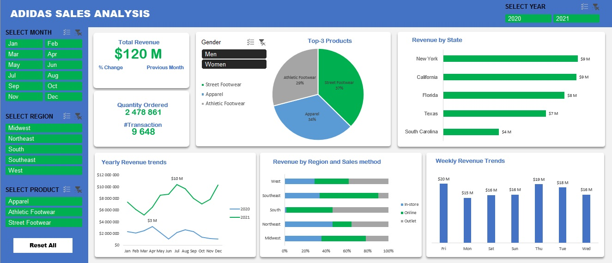

# Analyse des ventes d'Adidas

## Description du Projet

Ce projet consiste à analyser les données des ventes d'ADIDAS, en fournissant des indicateurs clés et des visualisations pour prendre des décisions.

## Jeu de Données

**Adidas Dataset.xlsx** : ce fichier contient les détails des ventes

## Méthodologie

### 1. Nettoyage et Transformation des données
On utilise Power Query pour importer, nettoyer et transformer les données.

- Corriger les types de données (Dates, ...)
- Créer de nouvelles colonnes (Products & Gender)
- Supprimer les doublons
- Créer une nouvelle table (la table 'Calendar')

### 2. Modélisation des Données
On établie des relations entre les différentes tables puis on crée des mesures DAX pour l'analyse.

Tables :

- Sales
- Calendar

Mesures DAX :

- Total Revenue = SUMX(Sales; [Price per Unit] * [Units Sold])
- NBTransaction = COUNTROWS(Sales)

### 3. KPI

- **Total Revenue** : 
Chiffre d'affaires total

- **Previous month revenue** : 
Chiffre d'affaires du mois précédent

- **Quantity Ordered** : 
Quantité de produits commandés

- **#Transaction** : 
Nombre de transactions

### 4. Analyse, Visualisation et Rapport

1 - **Top-3 Products :** 

- Déterminer les 3 meilleurs produits qui ont générés le plus de chiffre d'affaires.
- Représenter le résultat à l'aide d'un graphique en secteurs (Camembert).
- Gréer un segment 'Gender' pour filter les produits.

> Avec ce graphique, on a pu identifier les 3 meilleurs produits à savoir, 'Street Footwear', 'Apparel' et 'Athletic Footear'

2 - **Revenue by State :** 

- Déterminer les 5 Etats ayant générés le plus de chiffre d'affaires.
- Représenter le chiffre d'affaires par Etat à l'aide d'un diagramme en barres horizontales.

> Ce graphique nous a permis de savoir les 5 meilleurs Etats en terme de chiffre d'affaires à savoir, New York, California, Florida, Texas et South Carolina.

3 - **Yearly revenue trends :** 

- Représenter l'évolution du chiffre d'affaires au cours de l'année 2020 et 2021 à l'aide d'un graphique en courbes.
- Indiquer dans ce graphique le meilleur mois en terme de chiffre d'affaires.

> Ce graphique nous permets de comparer la performance des ventes entre l'année 2020 et 2021, et de connaître le meilleur mois en terme de ventes.

4 - **Revenue by Region and Sales Method :** 

- Créer un graphique en barres empilées horizontales illustrant le chiffre d'affaires par région et par methode de vente.

5 - **Weekly revenue trends :** 

- Créer un graphique en barres verticales illustrant la tendance hebdomadaire du chiffre d'affaires.

**Remarque**:
Les resultats ci-dessous sont des résultats généraux. Toutefois, ils peuvent être modifiés grâce aux filtres.

## Outils et Technologies utilisées :

-	Excel
-	Power Query
-	Power Pivot
-	DAX
- 	VBA

## Screenshots :

